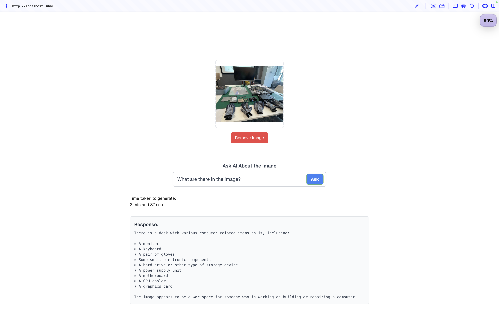

# SharMalKwar Project

This project integrates a Next.js frontend with an API layer that leverages the Ollama library and the Llama3.2 Vision model to process images and text prompts. The application allows users to input images and prompts, processes them via an API, and displays generated responses, including time metrics.


## Features

- **Image Input**: Upload and process images directly in the application.
- **Text Prompt Input**: Submit custom prompts for image-text interaction.
- **Image Resizing**: Utilizes `sharp` to resize images for optimal processing.
- **Ollama Integration**: Leverages the Llama3.2 Vision model for advanced text and image generation.
- **Time Metrics**: Displays the time taken for response generation.
- **Responsive UI**: Built with Next.js for a seamless user experience.

## Project Structure

```
|-- components/
    |-- ImageInput.js   # Handles image uploads and Base64 conversion.
    |-- UserPrompt.js   # Manages text prompt inputs and submission.
|-- pages/
    |-- api/
        |-- generate.js  # API route to process requests via Ollama and Llama3.2 Vision.
    |-- index.js         # Main application logic and UI.
|-- utils/
    |-- timeFormatter.js # Utility to format nanoseconds into human-readable time.
```

## Setup Instructions

1. **Clone the repository**:
   ```bash
   git clone <repository-url>
   cd <repository-folder>
   ```

2. **Install dependencies**:
   ```bash
   npm install
   ```

3. **Run ollama on your pc(pull llama3.2vision or your desired one)**:
   Make sure Ollama is installed and running on your system.

4. **Run the development server**:
   ```bash
   npm run dev
   ```
   Access the app at `http://localhost:3000`.

## API Details

### Endpoint: `/api/generate`

**Method**: `POST`

**Body**:
```json
{
  "imageBuffer": "<Base64 image string>",
  "prompt": "<User prompt>"
}
```

**Response**:
```json
{
  "total_duration": "<nanoseconds>",
  "message": {
    "content": "<Generated response>"
  }
}
```

### Key Functions

- **Image Resizing**: Images are resized to 500x500 pixels for consistent processing using `sharp`.
- **Base64 Validation**: Ensures uploaded images are valid Base64 strings.
- **Ollama Chat Integration**: Sends the resized image and prompt to the Llama3.2 Vision model.

## UI Components

### ImageInput
Handles image uploads and Base64 encoding.

### UserPrompt
Manages prompt inputs and submission, triggering API calls.

### Loading Animation
Displays a spinning loader while waiting for API responses.

## Utilities

### `timeFormatter.js`
Converts nanoseconds into a readable time format (e.g., seconds, milliseconds).

## Dependencies

- **Next.js**: Framework for building the frontend and API routes.
- **Ollama**: API integration for Llama3.2 Vision.
- **Sharp**: Image processing library for resizing.
- **React Icons**: For icons like Twitter.

## Future Enhancements

- **Model Options**: Allow users to select different models.
- **Image Previews**: Add previews for uploaded and resized images.
- **Enhanced Error Handling**: Improve feedback for invalid inputs or API issues.

## Credits

- **Author**: [LynnTheLight](https://github.com/lynnmeanslight)
- **Twitter**: [@lynnthelight](https://x.com/lynnthelight)

## License

This project is licensed under the MIT License. See the LICENSE file for details.

